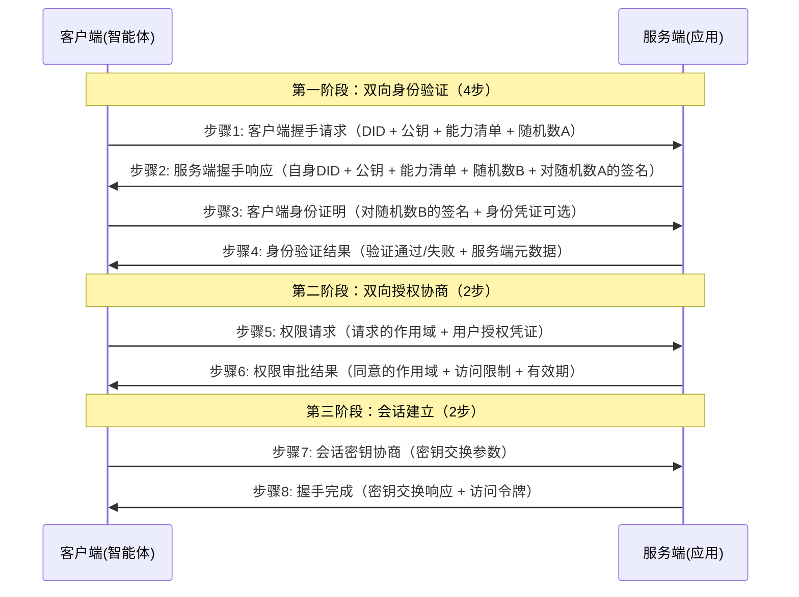

# Agent Trust Handshake (ATH) 可信握手协议
> 🛡️ 让AI之间的交互像人与人握手一样可信、安全、透明
## 📋 目录
- [项目简介](#项目简介)
- [解决什么问题](#解决什么问题)
- [核心设计理念](#核心设计理念)
- [协议工作流程](#协议工作流程)
- [核心握手流程](#核心握手流程)
  - [12步握手流程概览](#12步握手流程概览)
  - [详细步骤说明](#详细步骤说明)
  - [安全特性](#安全特性)
- [应用场景](#应用场景)
- [为什么选择ATH](#为什么选择ATH)
- [核心技术规范](#核心技术规范)
- [中文协议文档](#中文协议文档)
- [部署模式](#部署模式)
- [生态系统组成](#生态系统组成)
- [快速开始](#快速开始)
- [仓库目录结构说明](#仓库目录结构说明)
- [核心握手、鉴权逻辑位置](#核心握手鉴权逻辑位置)
- [开发者快速导航](#开发者快速导航)
- [生态系统实现指引](#生态系统实现指引)
- [开源协议](#开源协议)
- [参与贡献](#参与贡献)
---
## 🎯 项目简介
ATH（Agent Trust Handshake）是全球首个专门为AI代理设计的开源可信交互协议标准。
简单来说，它就是AI世界的"身份证+通行证+公证系统"三合一：
- ✅ **身份证**：每个AI代理都有唯一的数字身份，无法伪造
- ✅ **通行证**：AI要访问任何服务都需要双方同意，就像握手一样
- ✅ **公证系统**：所有交互都会留下不可篡改的记录，出了问题可以追溯
ATH在传统OAuth 2.0授权协议的基础上，创新性地加入了"双向可信握手"机制，不仅服务端要验证AI的身份，AI也要验证服务端的合法性，从根本上解决了AI交互的信任问题。
---
## ❓ 解决什么问题
在AI大爆发的今天，我们遇到了前所未有的信任危机：
| 痛点问题 | ATH的解决方案 |
|---------|-------------|
| 🤖 两个AI系统互不认识，不敢随便交互 | 统一身份认证体系，所有AI都有可信身份 |
| 🔍 AI访问用户数据没有明确授权，出了问题说不清 | 双向握手机制，每一次访问都需要用户和服务双方明确同意 |
| 🚫 恶意AI伪装成合法系统窃取数据 | 加密身份验证，无法伪造身份 |
| 📝 交互过程没有记录，出现纠纷无法追溯 | 所有操作都有不可篡改的存证记录 |
| 🔌 不同厂商的AI系统标准不统一，无法互联互通 | 统一协议标准，任何符合ATH标准的系统都可以无缝对接 |
举个生活化的例子：
以前AI交互就像陌生人随便进你家拿东西，没有门禁，没有登记，拿了什么你也不知道。
有了ATH之后，就像小区有了门禁系统：
1. 访客（AI）要出示身份证（可信身份）
2. 业主（用户）确认同意访客进入
3. 物业（服务端）确认访客有权限
4. 进门时间、去了哪里、做了什么都有记录
5. 离开时还有出门登记
整个过程安全、透明、可追溯。
---
## 💡 核心设计理念
ATH的设计始终围绕四个核心原则：
### 1. 「去中心化」原则
> 不依赖任何中心化机构，支持任意智能体连接任意服务
- 身份验证基于非对称加密算法，无需中央身份注册中心
- 授权决策由服务端和用户自主完成，无需第三方授权机构
- 支持跨平台、跨生态的自由互联，没有单点故障
### 2. 「双向信任」原则
> 没有任何一方可以无条件信任另一方
- AI代理需要验证服务端的合法性，防止接入恶意服务
- 服务端需要验证AI代理的身份，防止恶意访问
- 用户拥有最终的授权决定权，所有访问都需要用户明确同意
### 3. 「双向授权」原则
> 应用侧和用户侧授权均为必需，不可绕过
- 应用侧授权：服务端决定是否允许该智能体使用服务
- 用户侧授权：用户决定是否允许该智能体代表其行事
- 两者缺一不可，任何一方未授权都无法完成握手
### 4. 「最小权限」原则
> 只给AI刚好够用的权限，用完就收回
- AI每次请求只能获得当前任务需要的最小权限
- 权限有时间限制，到期自动失效
- 支持细粒度权限控制，可以精确到某个接口、某条数据
### 5. 「全程可追溯」原则
> 所有操作都有记录，出了问题可以查清楚
- 每一次握手、每一次访问、每一次授权都有加密存证
- 记录不可篡改、不可删除
- 支持审计和溯源，方便排查问题和处理纠纷
---
# 握手流程
ATH协议的核心是8步去中心化可信握手流程，在客户端和服务端之间直接建立双向可信的通信通道，无需任何中心化身份注册中心。
## 8步握手流程概览

## 详细步骤说明
### 核心设计理念：完全去中心化
ATH协议不依赖任何中心化的身份注册中心或第三方可信机构，所有身份验证和授权协商都在客户端和服务端之间直接完成：
- 身份验证基于非对称加密算法，双方直接验证对方的数字签名
- 应用侧授权由服务端自主决策，无需向第三方查询
- 用户侧授权由用户直接提供凭证，无需中心化授权机构
### 第一阶段：双向身份验证阶段（4步）
#### 步骤1：客户端身份宣告 (Client Identity Announcement)
客户端（智能体）发起连接请求，向服务端宣告自身身份信息：
- **客户端DID**：去中心化身份标识，唯一标识客户端身份
- **客户端公钥**：用于身份验证的公钥
- **支持的协议版本列表**：客户端支持的ATH协议版本号，按优先级排序
- **客户端能力集**：客户端支持的加密算法、签名算法等能力
- **随机数A**：客户端生成的随机挑战字符串，用于防止重放攻击
#### 步骤2：服务端身份回应 (Server Identity Response)
服务端返回自身身份信息并完成对客户端的首次验证：
- **服务端DID**：服务端的去中心化身份标识
- **服务端公钥**：用于身份验证的公钥
- **协商后的协议版本**：双方都支持的最高协议版本
- **服务端能力集**：服务端支持的加密算法、签名算法等能力
- **随机数B**：服务端生成的随机挑战字符串
- **对随机数A的签名**：服务端用自身私钥对随机数A签名，证明身份合法性
#### 步骤3：客户端身份证明 (Client Identity Proof)
客户端验证服务端身份后，提供自身身份证明：
- **对随机数B的签名**：客户端用自身私钥对随机数B签名，证明身份合法性
- **可选身份凭证**：客户端可提供第三方颁发的身份凭证，增强可信度
#### 步骤4：身份验证结果 (Identity Verification Result)
服务端验证客户端签名后，返回验证结果：
- **验证结果**：通过/失败
- **服务端元数据**：包含服务端点、支持的作用域列表、令牌有效期等配置
- **失败原因**：如果验证失败，返回明确的失败原因
### 第二阶段：双向授权协商阶段（2步）
#### 步骤5：权限请求 (Scope Request)
客户端向服务端请求访问权限，同时提供用户授权凭证：
- **请求的权限列表**：格式为`资源:操作`（如`user:read`, `data:write`）
- **访问有效期**：请求的访问凭证有效期
- **用户授权凭证**：用户签署的授权凭证，证明用户已同意该智能体代表其访问
- **请求上下文**：可选的业务场景说明，用于服务端授权决策
#### 步骤6：权限审批结果 (Scope Negotiation Result)
服务端根据自身安全策略和用户授权凭证进行审批：
- **同意的作用域列表**：最终授予的权限范围
- **拒绝的作用域及原因**：拒绝的权限和明确原因
- **访问限制条件**：IP限制、速率限制等附加限制
- **授权有效期**：最终授予的访问凭证有效期
### 第三阶段：会话建立阶段（2步）
#### 步骤7：会话密钥协商 (Session Key Negotiation)
客户端发起会话密钥协商：
- **支持的密钥交换算法列表**
- **密钥交换参数**：如ECDH的公钥参数
- **支持的加密套件列表**
#### 步骤8：握手完成 (Handshake Complete)
服务端完成密钥协商，颁发访问令牌：
- **密钥交换响应参数**
- **访问令牌**：签名后的短期访问凭证
- **会话密钥派生参数**
- 双方正式建立端到端加密通信通道
## 安全特性
- **完全去中心化**：无需任何中心化身份注册中心或授权机构
- **双向身份认证**：通过非对称加密直接验证对方身份，防止中间人攻击
- **双向授权机制**：需要应用侧和用户侧双重授权，缺一不可
- **最小权限原则**：只授予当前任务必需的最小权限
- **短期凭证**：访问凭证有效期短，降低泄露风险
- **不可抵赖性**：所有交互都有数字签名，可审计可追溯
---
## 🎯 应用场景
ATH几乎可以用在所有需要AI交互的场景：
### 1. 🤖 多AI代理协同
多个不同厂商的AI代理一起完成复杂任务，互相之间可以安全可信地交互。
### 2. 🔒 敏感数据处理
AI需要访问用户的隐私数据（如医疗数据、财务数据），所有访问都有明确授权和记录。
### 3. 🌐 跨平台服务对接
不同平台的AI服务可以按照统一标准对接，不需要重复开发适配层。
### 4. 🏢 企业级AI应用
企业内部的AI系统统一管控，所有访问都有审计记录，满足合规要求。
### 5. 💰 AI服务交易
AI服务的买卖双方通过ATH协议完成交易，自动结算，全程可追溯。

---
## ✨ 为什么选择ATH
| 对比项 | 传统授权方案 | ATH协议 |
|--------|-------------|--------|
| 信任模式 | 单向信任（只验证客户端） | 双向信任（客户端和服务端互相验证） |
| 授权机制 | 一次性授权，权限过大 | 最小权限，按需授权，到期自动失效 |
| 可追溯性 | 日志不全，容易被篡改 | 全程加密存证，不可篡改 |
| AI友好性 | 是为人设计的，不适合AI场景 | 专门为AI代理设计，符合AI交互特点 |
| 互联互通 | 不同厂商标准不统一 | 统一标准，任何符合标准的系统都可以对接 |
| 易用性 | 集成复杂，需要大量开发工作 | 提供多语言SDK，5分钟完成集成 |
---
## 📜 核心技术规范
### 1. 身份认证规范
- 采用非对称加密算法，每个AI代理有唯一的公私钥对
- 身份证书包含AI的基本信息、公钥、颁发机构、有效期等
- 支持跨平台、跨机构的身份互认
### 2. 握手协议规范
- 采用TLS 1.3加密传输，防止数据被窃听和篡改
- 握手报文有统一的格式规范，包含身份信息、权限请求、上下文信息等
- 支持多种签名算法，兼容不同安全级别的需求
### 3. 权限控制规范
- 支持基于角色的权限控制（RBAC）
- 支持细粒度的权限声明，可以精确到接口级别
- 权限有效期可配置，支持临时权限和永久权限
### 4. 存证审计规范
- 所有交互记录采用默克尔树结构存储，不可篡改
- 支持加密存证，保护用户隐私
- 提供标准化的审计接口，方便对接第三方审计系统
---
## 📚 中文协议文档
为了方便国内开发者和非技术人员理解，我们提供了完整的中文注释版协议：
📄 [ATH协议标准-中文注释版](./specification/ath-protocol-chinese-commented.md)
---
## 🚀 部署模式
ATH支持两种部署模式，可以根据实际需求选择：
### 模式一：网关模式（推荐）
```
AI代理 → ATH网关 → 后端服务
```
- **特点**：所有请求都经过ATH网关统一验证和处理
- **优势**：部署简单，不需要修改原有服务代码
- **适用场景**：企业级应用、多服务场景、需要统一管控的场景
### 模式二：原生模式
```
AI代理 ↔ ATH原生服务
```
- **特点**：服务本身就实现了ATH协议，直接和AI代理握手
- **优势**：性能更高，延迟更低
- **适用场景**：高性能需求场景、轻量级应用、嵌入式设备
---
## 🌐 生态系统组成
ATH是一个完整的生态系统，由五个核心部分组成：
| 组件 | 作用 | 适用人群 |
|------|------|----------|
| [agent-trust-handshake-protocol](https://github.com/ath-protocol/agent-trust-handshake-protocol) | 核心协议标准（就是本仓库） | 协议研究者、标准制定者、SDK开发者 |
| [typescript-sdk](https://github.com/ath-protocol/typescript-sdk) | TypeScript/JavaScript开发工具包 | 前端开发者、Node.js开发者 |
| [python-sdk](https://github.com/ath-protocol/python-sdk) | Python开发工具包 | AI开发者、数据科学家、后端开发者 |
| [athx](https://github.com/ath-protocol/athx) | ATH核心引擎，处理握手和认证逻辑 | 运维人员、架构师 |
| [gateway](https://github.com/ath-protocol/gateway) | ATH网关服务，统一接入入口 | 运维人员、架构师 |
---
## 📄 开源协议
本项目采用 **OpenATH License** 开源协议，您可以自由使用、修改和分发，具体条款请查看LICENSE文件。
## 🤝 参与贡献
我们欢迎所有对可信AI感兴趣的开发者参与贡献！无论是完善协议规范、提交Bug、编写文档，还是提出改进建议，都能让ATH生态变得更好。
> 💡 ATH的愿景：让每一次AI交互都值得信任！
---
## 📁 仓库目录结构说明
本仓库是ATH协议的标准定义仓库，只包含协议规范和文档，所有具体实现都在独立的仓库中。
```
agent-trust-handshake-protocol/
├── 📄 根目录文件
│   ├── README.md                   # 项目说明文档（就是本文件）
│   ├── LICENSE                     # OpenATH开源协议
│   ├── CODE_OF_CONDUCT.md          # 社区参与行为准则
│   ├── CONTRIBUTING.md             # 协议贡献指南
│   └── SECURITY.md                 # 安全漏洞上报流程
│
├── 📚 docs/                        # 官方技术文档
│   ├── getting-started/            # 快速入门指南，新手5分钟了解ATH
│   ├── learn/                      # 核心概念深度讲解，包含架构、流程、安全原理
│   ├── develop/                    # 开发指南，教你如何实现ATH协议
│   └── tutorials/                  # 分步教程，包含安全最佳实践、审计配置等
│
├── 📝 example/                     # 真实应用场景示例
│   ├── shopping-scenario.mdx       # 电商购物场景完整示例
│   └── gateway-scenario.mdx        # API网关场景完整示例
│
├── 📜 specification/               # 核心协议规范（最权威的标准定义）
│   ├── 0.1/                        # v0.1版本协议
│   │   ├── basic/                  # 基础协议规范
│   │   │   ├── handshake-flow.mdx  # 【核心】可信握手12步流程详细定义
│   │   │   └── handshake-flow.zh.mdx # 中文版握手流程规范
│   │   ├── client/                 # 客户端协议规范
│   │   │   ├── handshake-flow.mdx  # 客户端握手流程实现规范
│   │   │   └── reference-implementation.mdx # 客户端参考实现
│   │   └── server/                 # 服务端协议规范
│   │       ├── handshake-flow.mdx  # 服务端握手流程实现规范
│   │       └── reference-implementation.mdx # 服务端参考实现
│   └── ath-protocol-chinese-commented.md # 中文注释版协议（通俗易懂）
│
├── 🏗️ schema/                      # 机器可读数据结构定义
│   └── 0.1/
│       ├── schema.json             # JSON Schema格式，可直接用于代码生成、参数校验
│       └── meta.json               # 协议元数据定义
│
├── 🌐 zh/                          # 中文文档专区（和英文内容100%同步）
│   ├── docs/                       # 中文版技术文档
│   └── specification/              # 中文版协议规范
│
├── 🎨 logo/                        # 项目Logo资源（可自由使用）
└── 👥 community/                   # 社区相关内容
    ├── roadmap.mdx                 # 项目发展路线图
    ├── comparison.mdx              # 与OAuth、JWT等其他协议的对比
    ├── glossary.mdx                # 术语表
    └── contributing.mdx            # 贡献者指南
```
---
## 🎯 核心握手、鉴权逻辑位置
所有核心的协议规范都在`specification/`目录下：
### 🔑 核心文件清单
| 文件路径 | 内容说明 | 重要程度 |
|---------|----------|----------|
| 📄 `specification/0.1/client/handshake-flow.mdx` | **最核心的握手流程规范**，详细定义了从发起请求到完成握手的12步完整流程，包括每一步的报文格式、交互逻辑、错误处理等 | ⭐⭐⭐⭐⭐ |
| 📄 `specification/0.1/server/authorization.mdx` | **鉴权逻辑规范**，定义了权限验证、授权决策、最小权限原则的具体实现标准 | ⭐⭐⭐⭐⭐ |
| 📄 `specification/0.1/client/identity.mdx` | 身份认证规范，定义了AI代理和服务的数字身份格式、生成方式、验证逻辑 | ⭐⭐⭐⭐ |
| 📄 `specification/0.1/server/token.mdx` | 令牌规范，定义了访问令牌的格式、生成算法、有效期管理、验证方式 | ⭐⭐⭐⭐ |
| 📄 `specification/0.1/client/security.mdx` | 安全规范，定义了加密算法、签名算法、防攻击要求等安全相关标准 | ⭐⭐⭐⭐ |
| 📄 `spec/openapi.yaml` | OpenAPI接口定义，所有协议的HTTP接口格式都在这里，SDK和服务端实现都要遵循这个标准 | ⭐⭐⭐⭐ |
| 📄 `schema/0.1/schema.json` | 数据结构JSON Schema定义，所有报文格式的校验标准 | ⭐⭐⭐ |
### 💡 快速查找技巧
- 如果要**实现协议逻辑**：先看`spec/openapi.yaml`和`schema/0.1/schema.json`，这两个是可以直接用代码解析的机器可读规范
- 如果要**理解协议原理**：先看`docs/learn/trusted-handshake.mdx`，有图文并茂的讲解，然后再看`specification/`下的详细规范
- 如果是**中文使用者**：直接看`zh/`目录下的中文版本，内容和英文完全同步
---
## 🏁 快速开始
### 如果你是普通用户：
1. 看到这里你已经懂ATH是干什么的了！
2. 想体验的话可以去我们的[在线Demo](https://demo.ath-protocol.org)感受一下握手流程
3. 有兴趣的话可以继续看下面的技术内容
### 如果你是协议研究者：
1. 查看本仓库的`specs/`目录，了解详细的协议规范
2. 查看`examples/`目录，了解协议的实际使用示例
3. 提交Issue或PR参与协议的改进和讨论
### 如果你是应用开发者：
1. 选择对应语言的SDK（TypeScript/Python）
2. 按照SDK文档的指引，3步完成集成
3. 你的应用就拥有了可信交互能力
### 如果你是运维人员：
1. 部署ATH核心引擎（athx）和网关服务（gateway）
2. 配置服务和权限规则
3. 接入你的AI应用和后端服务
---
## 🚀 开发者快速导航
| 角色 | 推荐阅读顺序 |
|------|--------------|
| 👨‍💻 SDK开发者 | 1. `docs/getting-started/quickstart.mdx` → 2. `spec/openapi.yaml` → 3. `schema/0.1/schema.json` |
| 👷‍♂️ 服务端开发者 | 1. `docs/develop/build-gateway.mdx` → 2. `specification/0.1/server/`目录下所有文件 |
| 📝 协议研究者 | 1. `docs/learn/architecture.mdx` → 2. `specification/0.1/client/`目录下所有文件 → 3. 社区`roadmap.mdx` |
| 🎯 业务开发者 | 1. `docs/getting-started/intro.mdx` → 2. `docs/examples/scenario.mdx` → 3. 对应语言的SDK文档 |
---
## 🌱 生态系统实现指引
本仓库只定义协议标准，具体的实现代码都在独立的仓库中，你可以根据需要直接使用：
### 📦 官方实现仓库
| 仓库 | 功能 | 适用人群 | 地址 |
|------|------|----------|------|
| 🐍 [python-sdk](https://github.com/ath-protocol/python-sdk) | Python语言SDK | AI开发者、后端工程师 | 用于给Python应用、AI代理集成ATH能力 |
| 🔌 [typescript-sdk](https://github.com/ath-protocol/typescript-sdk) | TypeScript/JavaScript语言SDK | 前端工程师、Node.js开发者 | 用于给网页、小程序、Node.js应用集成ATH能力 |
| ⚡ [athx](https://github.com/ath-protocol/athx) | ATH核心引擎实现 | 运维工程师、架构师 | 处理握手、认证、授权、令牌管理的核心服务 |
| 🚪 [gateway](https://github.com/ath-protocol/gateway) | ATH网关服务实现 | 运维工程师、架构师 | 统一接入入口，提供安全防护、负载均衡、流量控制 |
### 💡 实现者快速指引
- 如果你要**开发SDK**：参考本仓库的`spec/openapi.yaml`和`schema/0.1/schema.json`，按照接口标准实现即可
- 如果你要**开发网关/服务端**：参考`specification/0.1/server/`目录下的所有规范
- 如果你要**开发AI代理**：直接使用对应语言的SDK，5分钟就能完成集成
