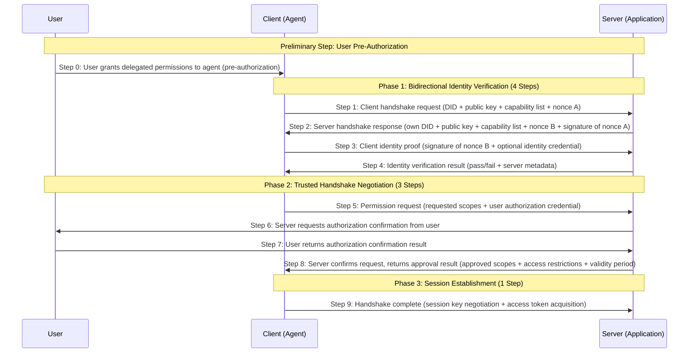

[中文版 / Chinese Version](./zh/README.md)

# Agent Trust Handshake (ATH) Protocol
> 🛡️ Making AI-to-AI interactions as trustworthy, secure, and transparent as a handshake between people
## 📋 Table of Contents
- [Project Overview](#project-overview)
- [What Problems Does It Solve](#what-problems-does-it-solve)
- [Core Design Principles](#core-design-principles)
- [Handshake Flow](#handshake-flow)
  - [9-Step Handshake Flow Overview](#9-step-handshake-flow-overview)
  - [Detailed Step Descriptions](#detailed-step-descriptions)
  - [Security Features](#security-features)
- [Use Cases](#use-cases)
- [Why Choose ATH](#why-choose-ath)
- [Core Technical Specifications](#core-technical-specifications)
- [Chinese Protocol Documentation](#chinese-protocol-documentation)
- [Deployment Modes](#deployment-modes)
- [Ecosystem Components](#ecosystem-components)
- [Quick Start](#quick-start)
- [Repository Directory Structure](#repository-directory-structure)
- [Core Handshake and Authentication Logic Locations](#core-handshake-and-authentication-logic-locations)
- [Developer Quick Navigation](#developer-quick-navigation)
- [Ecosystem Implementation Guide](#ecosystem-implementation-guide)
- [License](#license)
- [Contributing](#contributing)
---
## 🎯 Project Overview
ATH (Agent Trust Handshake) is the world's first open-source trusted interaction protocol standard designed specifically for AI agents, featuring **three-party participation and trusted handshake** mechanisms.
In simple terms, it is the "trusted access gatekeeper" of the AI world, perfectly solving the authorization problem when agents access services:
- ✅ **User Authorization**: Users are the owners of resources; all access to user resources must receive explicit user consent
- ✅ **Service Authorization**: Services are the providers of resources and have the right to decide whether to allow agents to access their services
- ✅ **Trusted Handshake**: Only when both user and service trusted handshakes are obtained can an agent successfully access resources
- ✅ **Full Traceability**: All interactions leave tamper-proof records, enabling clear accountability when issues arise
ATH innovatively adds "independent user roles" and "bidirectional trusted handshake" mechanisms on top of the traditional OAuth 2.0 authorization protocol, fundamentally solving the trust problem in AI interactions.
---
## ❓ What Problems Does It Solve
In today's AI explosion, we face an unprecedented trust crisis:
| Pain Point | ATH's Solution |
|---------|-------------|
| 🤖 AI agents freely access user data without the user's knowledge | Users participate as independent parties; all access must receive explicit user authorization |
| 🔍 Access authorization is unclear — when issues arise, it's impossible to determine whether the AI, the service, or the user is responsible | All three parties have clear responsibility boundaries; all operations are signed and recorded for clear accountability |
| 🚫 Malicious AI impersonates legitimate systems to steal data | Bidirectional identity verification — agents and services mutually verify each other's identity, making impersonation impossible |
| 📝 No records of interactions, making dispute resolution impossible | All operations have tamper-proof audit records supporting auditing and traceability |
| 🔌 Different vendors' AI systems follow different standards and cannot interoperate | Unified protocol standard — any ATH-compliant system can seamlessly connect |
A real-life analogy:
Previously, AI accessing services was like a delivery person walking into your home to take things — no consent needed, the property management doesn't intervene, and you have no idea what was taken.
With ATH, it's like having a complete access control system:
1. You (user) tell the delivery person (agent) in advance that they can pick up your package and give them a pickup code (user authorization credential)
2. The delivery person arrives at the gate and presents their work ID (agent identity) and your pickup code (user authorization) to the property management (service)
3. The property management verifies the delivery person's identity is authentic and can optionally call you to confirm (optional secondary verification)
4. You confirm that you did indeed order the delivery (user confirmation)
5. The property management grants access and the delivery person can enter (service authorization)
6. The entire process is recorded on camera (audit trail)
The entire process is secure, transparent, and has clear accountability — the rights of all three roles are protected.
---
## 💡 Core Design Principles
ATH's design consistently revolves around six core principles:
### 1. User Sovereignty Principle
> Users are the absolute owners of resources and hold the ultimate decision-making power
- All access to user resources must receive explicit user authorization
- Users can grant, modify, or revoke authorization at any time
- User authorization intent supersedes all else — no organization or individual can override it
### 2. Three-Party Participation Principle
> A complete interaction involves three independent roles: user, agent, and service
- User: Resource owner, authorization decision-maker
- Agent: User's executor, accesses services on behalf of the user
- Service: Resource provider, service decision-maker
- All three parties have clear responsibilities, defined boundaries, and do not interfere with each other
### 3. Trusted Handshake Principle
> Agents must obtain trusted handshakes from both the user and the service to access resources
- User authorization: The user agrees to let the agent access specified resources on their behalf
- Service authorization: The service agrees to let the agent access its services
- Both are indispensable — access cannot be completed if either party has not authorized it
### 4. Decentralized Principle
> No reliance on any centralized authority; supports any agent connecting to any service
- Identity verification is based on asymmetric cryptography, requiring no central authority
- Authorization decisions are made independently by users and services, without any third-party authorization body
- Supports free interconnection across platforms and ecosystems with no single point of failure
### 5. Least Privilege Principle
> Only grant agents the minimum permissions needed, and revoke them when done
- Each agent request can only obtain the minimum permissions required for the current task
- Permissions have time limits and automatically expire
- Supports fine-grained permission control, down to specific endpoints or individual data records
### 6. Full Traceability Principle
> All operations are recorded; when issues arise, they can be thoroughly investigated
- Every handshake, every access, and every authorization has encrypted audit records
- Records are tamper-proof and cannot be deleted
- Supports auditing and traceability for troubleshooting and dispute resolution
---
# Handshake Flow
The core of the ATH protocol is a 9-step trusted handshake flow with three-party participation, involving three independent roles: **Agent (Client)**, **Application (Server)**, and **User**. It implements a "User + Service" trusted handshake mechanism without any centralized authority.
## 9-Step Handshake Flow Overview

## Core Design Philosophy: Three-Party Participation, Trusted Handshake
The ATH protocol is a three-party protocol; a complete trusted handshake requires the participation of all three roles:
| Role | Responsibility | Core Rights |
|------|------|----------|
| **User** | Resource owner | Ultimate decision-making power; all access to user resources must receive explicit user authorization |
| **Agent (Client)** | User's executor | Accesses services on behalf of the user, executes specific tasks |
| **Application (Server)** | Resource provider | Decides whether to allow the agent to access its services |
> ✅ **Trusted Handshake Mechanism**: For an agent to successfully access a service, it must obtain two authorizations — both are indispensable:
> 1. **User-Side Permission**: The user agrees to let the agent access specified resources on their behalf
> 2. **Service-Side Permission**: The server agrees to let the agent access its services
## Detailed Step Descriptions
### Preliminary Step: User Pre-Authorization
#### Step 0: User Grants Delegated Permissions to Agent
Before using an agent, the user pre-authorizes it with delegated permissions, clearly defining the scope within which the agent can act on their behalf:
- The user signs an authorization credential specifying the authorized resource scope, validity period, operation restrictions, etc.
- The agent obtains the user authorization credential to use as proof of user authorization when subsequently accessing services
- Pre-authorization can be one-time, short-term, or long-term; the user can revoke it at any time
### Phase 1: Bidirectional Identity Verification (4 Steps)
#### Step 1: Client Identity Announcement
The agent (client) initiates a connection request to the server, announcing its identity information:
- **Client DID**: Decentralized Identifier that uniquely identifies the agent
- **Client Public Key**: Public key used for identity verification
- **Supported Protocol Version List**: ATH protocol versions supported by the client
- **Client Capability Set**: Supported encryption algorithms, signature algorithms, and other capabilities
- **Nonce A**: Random challenge string generated by the client to prevent replay attacks
#### Step 2: Server Identity Response
The server returns its own identity information, completing initial verification of the client:
- **Server DID**: The server's Decentralized Identifier
- **Server Public Key**: Public key used for identity verification
- **Negotiated Protocol Version**: The highest protocol version supported by both parties
- **Server Capability Set**: Supported encryption algorithms, signature algorithms, and other capabilities
- **Nonce B**: Random challenge string generated by the server
- **Signature of Nonce A**: Signed with the server's private key to prove identity legitimacy
#### Step 3: Client Identity Proof
After verifying the server's identity, the agent provides its own identity proof:
- **Signature of Nonce B**: Signed with the client's private key to prove identity legitimacy
- **Optional Identity Credential**: May provide a third-party-issued identity credential to enhance trustworthiness
#### Step 4: Identity Verification Result
After verifying the client's signature, the server returns the verification result:
- **Verification Result**: Pass/Fail
- **Server Metadata**: Includes service endpoints, supported scope list, token validity period, etc.
- **Failure Reason**: If verification fails, a clear failure reason is returned
### Phase 2: Trusted Handshake Negotiation (3 Steps)
#### Step 5: Scope Request
The agent requests access permissions from the server while submitting the user's pre-authorization credential:
- **Requested Permission List**: In the format `resource:action` (e.g., `user:read`, `data:write`)
- **Access Validity Period**: Requested access credential validity period
- **User Authorization Credential**: The authorization credential pre-signed by the user, proving the user has consented to the access
- **Request Context**: Optional business scenario description for authorization decision-making
#### Step 6: Server Requests Authorization Confirmation from User
The server sends an authorization confirmation request to the user to ensure the user authorization is genuine and valid:
- The server sends an authorization confirmation request to the user, including the agent's identity and the requested permission scope

#### Step 7: User Returns Authorization Confirmation Result
The user confirms the authorization request and returns the confirmation result:
- The user can choose to approve, reject, or modify the authorization scope
- The confirmation result is signed by the user and is legally binding
#### Step 8: Scope Negotiation Result
The server combines the user's authorization result with its own security policies to make a final approval:
- **Approved Scope List**: The final granted permission scope
- **Rejected Scopes and Reasons**: Rejected permissions with clear reasons
- **Access Restriction Conditions**: IP restrictions, rate limits, and other additional restrictions
- **Authorization Validity Period**: The final granted access credential validity period
### Phase 3: Session Establishment (1 Step)
#### Step 9: Handshake Complete
Both parties complete key negotiation and establish an encrypted communication channel:
- The agent and server complete session key negotiation
- The server issues a short-lived access token to the agent
- Both parties formally establish an end-to-end encrypted communication channel
- The agent can begin using the token to access service resources
## Security Features
- **Three-Party Participation Mechanism**: Users participate as independent roles with ultimate decision-making power
- **Trusted Handshake Mechanism**: Requires both user authorization and service authorization — both are indispensable
- **Fully Decentralized**: No centralized or authorization authority required
- **Bidirectional Identity Authentication**: Directly verifies the other party's identity through asymmetric cryptography, preventing man-in-the-middle attacks
- **Least Privilege Principle**: Only grants the minimum permissions necessary for the current task
- **Short-Lived Credentials**: Access credentials have short validity periods, reducing the risk of leakage
- **Non-Repudiation**: All interactions are digitally signed, enabling auditing and traceability
---
## 🎯 Use Cases
ATH can be used in virtually any scenario requiring AI interactions:
### 1. 🤖 Multi-Agent Collaboration
Multiple AI agents from different vendors work together on complex tasks, interacting securely and trustworthily with each other.
### 2. 🔒 Sensitive Data Processing
When AI needs to access users' private data (e.g., medical records, financial data), all access has explicit authorization and records.
### 3. 🌐 Cross-Platform Service Integration
AI services on different platforms can connect following a unified standard, eliminating the need to develop custom adapters.
### 4. 🏢 Enterprise AI Applications
Unified management and control of AI systems within an enterprise, with full audit records for all access to meet compliance requirements.
### 5. 💰 AI Service Marketplace
Buyers and sellers of AI services complete transactions through the ATH protocol, with automated settlement and full traceability.

---
## ✨ Why Choose ATH
| Comparison | Traditional Authorization | ATH Protocol |
|--------|-------------|--------|
| Trust Model | Unidirectional trust (only verifies the client) | Bidirectional trust (client and server mutually verify each other) |
| Authorization Mechanism | One-time authorization with excessive permissions | Least privilege, on-demand authorization, auto-expiry |
| Traceability | Incomplete logs, easily tampered with | Full encrypted audit trail, tamper-proof |
| AI Friendliness | Designed for humans, not suited for AI scenarios | Purpose-built for AI agents, aligned with AI interaction patterns |
| Interoperability | Different vendors follow different standards | Unified standard — any compliant system can connect |
| Ease of Use | Complex integration requiring extensive development | Multi-language SDKs available, integrate in 5 minutes |
---
## 📜 Core Technical Specifications
### 1. Identity Authentication Specification
- Uses asymmetric cryptography; each AI agent has a unique public-private key pair
- Identity certificates include basic AI information, public key, issuing authority, validity period, etc.
- Supports cross-platform, cross-organization identity mutual recognition
### 2. Handshake Protocol Specification
- Uses TLS 1.3 encrypted transport to prevent eavesdropping and tampering
- Handshake messages follow a unified format specification containing identity information, permission requests, context information, etc.
- Supports multiple signature algorithms to accommodate different security level requirements
### 3. Permission Control Specification
- Supports Role-Based Access Control (RBAC)
- Supports fine-grained permission declarations down to the API endpoint level
- Permission validity periods are configurable, supporting both temporary and permanent permissions
### 4. Audit Trail Specification
- All interaction records are stored using a Merkle tree structure, making them tamper-proof
- Supports encrypted audit records to protect user privacy
- Provides standardized audit interfaces for easy integration with third-party audit systems
---
## 📚 Chinese Protocol Documentation
To help Chinese-speaking developers and non-technical readers understand the protocol, we provide a fully annotated Chinese version:
📄 [ATH Protocol Standard - Chinese Annotated Version](./specification/0.1/basic/handshake-flow.zh.mdx)
---
## 🚀 Deployment Modes
ATH supports two deployment modes; choose based on your actual needs:
### Mode 1: Gateway Mode (Recommended)
```
AI Agent → ATH Gateway → Backend Service
```
- **Features**: All requests pass through the ATH gateway for unified verification and processing
- **Advantages**: Simple deployment; no need to modify existing service code
- **Use Cases**: Enterprise applications, multi-service scenarios, scenarios requiring unified management
### Mode 2: Native Mode
```
AI Agent ↔ ATH Native Service
```
- **Features**: The service itself implements the ATH protocol and directly handshakes with AI agents
- **Advantages**: Higher performance, lower latency
- **Use Cases**: High-performance scenarios, lightweight applications, embedded devices
---
## 🌐 Ecosystem Components
ATH is a complete ecosystem consisting of five core components:
| Component | Purpose | Target Audience |
|------|------|----------|
| [agent-trust-handshake-protocol](https://github.com/ath-protocol/agent-trust-handshake-protocol) | Core protocol standard (this repository) | Protocol researchers, standards developers, SDK developers |
| [typescript-sdk](https://github.com/ath-protocol/typescript-sdk) | TypeScript/JavaScript SDK | Frontend developers, Node.js developers |
| [python-sdk](https://github.com/ath-protocol/python-sdk) | Python SDK | AI developers, data scientists, backend developers |
| [athx](https://github.com/ath-protocol/athx) | ATH core engine handling handshake and authentication logic | Operations engineers, architects |
| [gateway](https://github.com/ath-protocol/gateway) | ATH gateway service, unified access entry point | Operations engineers, architects |
---
## 📄 License
This project is licensed under the **OpenATH License**. You are free to use, modify, and distribute it. Please see the LICENSE file for full terms.
## 🤝 Contributing
We welcome all developers interested in trustworthy AI to contribute! Whether it's improving the protocol specification, submitting bugs, writing documentation, or suggesting improvements — every contribution makes the ATH ecosystem better.
> 💡 ATH's Vision: Making every AI interaction trustworthy!
---
## 📁 Repository Directory Structure
This repository is the ATH protocol's standard definition repository. It contains only the protocol specification and documentation; all concrete implementations reside in separate repositories.
```
agent-trust-handshake-protocol/
├── 📄 Root Files
│   ├── README.md                   # Project documentation (this file)
│   ├── LICENSE                     # OpenATH License
│   ├── CODE_OF_CONDUCT.md          # Community Code of Conduct
│   ├── CONTRIBUTING.md             # Contribution Guide
│   └── SECURITY.md                 # Security Vulnerability Reporting Process
│
├── 📚 docs/                        # Official Technical Documentation
│   ├── getting-started/            # Quick start guide — get up to speed with ATH in 5 minutes
│   ├── learn/                      # In-depth core concepts including architecture, flow, and security principles
│   ├── develop/                    # Development guide — how to implement the ATH protocol
│   └── tutorials/                  # Step-by-step tutorials including security best practices and audit configuration
│
├── 📝 example/                     # Real-World Application Scenario Examples
│   ├── shopping-scenario.mdx       # Complete e-commerce shopping scenario example
│   └── gateway-scenario.mdx        # Complete API gateway scenario example
│
├── 📜 specification/               # Core Protocol Specification (the most authoritative standard definitions)
│   ├── 0.1/                        # v0.1 Protocol
│   │   ├── basic/                  # Basic protocol specification
│   │   │   ├── handshake-flow.mdx  # [Core] 9-step trusted handshake flow specification
│   │   │   └── handshake-flow.zh.mdx # Chinese version of the handshake flow specification
│   │   ├── client/                 # Client protocol specification
│   │   │   ├── handshake-flow.mdx  # Client handshake flow implementation specification
│   │   │   └── reference-implementation.mdx # Client reference implementation
│   │   └── server/                 # Server protocol specification
│   │       ├── handshake-flow.mdx  # Server handshake flow implementation specification
│   │       └── reference-implementation.mdx # Server reference implementation
│
├── 🏗️ schema/                      # Machine-Readable Data Structure Definitions
│   └── 0.1/
│       ├── schema.json             # JSON Schema format — can be used directly for code generation and parameter validation
│       └── meta.json               # Protocol metadata definition
│
├── 🎬 demo/                        # Interactive Protocol Demo
│   ├── ath_simple_demo.py          # English demo — 9-step handshake with loading animations
│   └── ath_simple_demo_zh.py       # Chinese demo
│
├── 🌐 zh/                          # Chinese Documentation Section
│   ├── docs/                       # Chinese technical documentation
│   └── specification/              # Chinese protocol specification
│
├── 🎨 logo/                        # Project Logo Assets (free to use)
└── 👥 community/                   # Community Content
    ├── roadmap.mdx                 # Project roadmap
    ├── comparison.mdx              # Comparison with OAuth, JWT, and other protocols
    ├── glossary.mdx                # Glossary of terms
    └── contributing.mdx            # Contributor guide
```
---
## 🎯 Core Handshake and Authentication Logic Locations
All core protocol specifications are located in the `specification/` directory:
### 🔑 Core File List
| File Path | Description | Importance |
|---------|----------|----------|
| 📄 `specification/0.1/basic/handshake-flow.mdx` | **Core handshake flow specification** — the 9-step trusted handshake with message formats and security requirements | ⭐⭐⭐⭐⭐ |
| 📄 `specification/0.1/client/handshake-flow.mdx` | **Client handshake flow** — client-side implementation specification for the 9-step handshake | ⭐⭐⭐⭐⭐ |
| 📄 `specification/0.1/server/handshake-flow.mdx` | **Server handshake flow** — server-side implementation including authorization and token issuance | ⭐⭐⭐⭐⭐ |
| 📄 `specification/0.1/client/reference-implementation.mdx` | Client reference implementation — Python code examples for identity, authorization, and handshake modules | ⭐⭐⭐⭐ |
| 📄 `specification/0.1/server/reference-implementation.mdx` | Server reference implementation — Python code examples for verification, permission, and token modules | ⭐⭐⭐⭐ |
| 📄 `specification/0.1/openapi.mdx` | OpenAPI interface definitions — all protocol HTTP interface formats; SDKs and server implementations must follow this standard | ⭐⭐⭐⭐ |
| 📄 `schema/0.1/schema.json` | Data structure JSON Schema definitions — validation standards for all message formats | ⭐⭐⭐ |
### 💡 Quick Lookup Tips
- To **implement protocol logic**: Start with `specification/0.1/openapi.mdx` and `schema/0.1/schema.json` — these are machine-readable specifications that can be directly parsed by code
- To **understand protocol principles**: Start with `docs/learn/trusted-handshake.mdx` for illustrated explanations, then dive into the detailed specifications under `specification/`
- For **Chinese readers**: Go directly to the `zh/` directory for the Chinese version, which is fully synchronized with the English content
---
## 🏁 Quick Start
### If you are a general user:
1. By reading this far, you already understand what ATH does!
2. If you'd like to try it out, visit our [Online Demo](https://demo.ath-protocol.org) to experience the handshake flow
3. If interested, continue reading the technical content below
### If you are a protocol researcher:
1. Review the `specification/` directory in this repository for detailed protocol specifications
2. Review the `example/` directory for real-world usage examples
3. Submit Issues or PRs to participate in protocol improvement and discussion
### If you are an application developer:
1. Choose the SDK for your language (TypeScript/Python)
2. Follow the SDK documentation — integrate in 3 steps
3. Your application now has trusted interaction capabilities
### If you are an operations engineer:
1. Deploy the ATH core engine (athx) and gateway service (gateway)
2. Configure services and permission rules
3. Connect your AI applications and backend services
---
## 🚀 Developer Quick Navigation
| Role | Recommended Reading Order |
|------|--------------|
| 👨‍💻 SDK Developer | 1. `docs/getting-started/quickstart.mdx` → 2. `specification/0.1/openapi.mdx` → 3. `schema/0.1/schema.json` |
| 👷‍♂️ Server Developer | 1. `docs/develop/build-gateway.mdx` → 2. All files under `specification/0.1/server/` |
| 📝 Protocol Researcher | 1. `docs/learn/architecture.mdx` → 2. All files under `specification/0.1/client/` → 3. Community `roadmap.mdx` |
| 🎯 Business Developer | 1. `docs/getting-started/intro.mdx` → 2. `example/shopping-scenario.mdx` → 3. Corresponding language SDK documentation |
---
## 🌱 Ecosystem Implementation Guide
This repository only defines the protocol standard. All concrete implementation code resides in separate repositories, which you can use directly as needed:
### 📦 Official Implementation Repositories
| Repository | Function | Target Audience | Description |
|------|------|----------|------|
| 🐍 [python-sdk](https://github.com/ath-protocol/python-sdk) | Python SDK | AI developers, backend engineers | Integrates ATH capabilities into Python applications and AI agents |
| 🔌 [typescript-sdk](https://github.com/ath-protocol/typescript-sdk) | TypeScript/JavaScript SDK | Frontend engineers, Node.js developers | Integrates ATH capabilities into web apps, mini-programs, and Node.js applications |
| ⚡ [athx](https://github.com/ath-protocol/athx) | ATH core engine implementation | Operations engineers, architects | Core service handling handshake, authentication, authorization, and token management |
| 🚪 [gateway](https://github.com/ath-protocol/gateway) | ATH gateway service implementation | Operations engineers, architects | Unified access entry point providing security protection, load balancing, and traffic control |
### 💡 Quick Guide for Implementers
- To **develop an SDK**: Refer to `specification/0.1/openapi.mdx` and `schema/0.1/schema.json` in this repository and implement according to the interface standards
- To **develop a gateway/server**: Refer to all specifications under the `specification/0.1/server/` directory
- To **develop an AI agent**: Simply use the corresponding language SDK — integrate in 5 minutes
