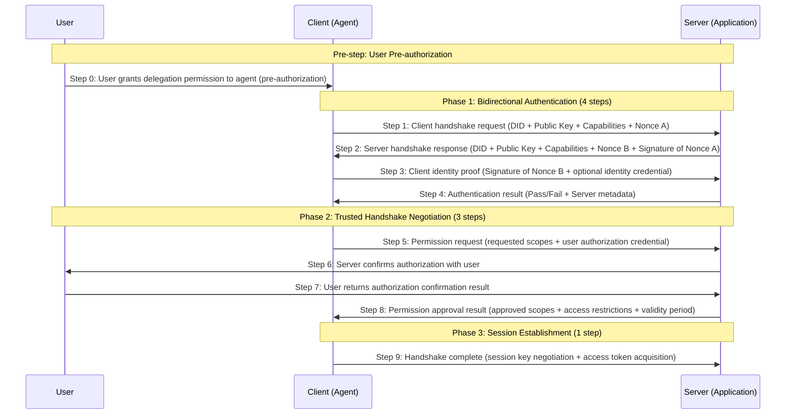

# Agent Trust Handshake (ATH) Protocol
> 🛡️ Making AI-to-AI interactions as trustworthy, secure, and transparent as a handshake between people

[中文](https://github.com/ath-protocol/agent-trust-handshake-protocol)
## 📋 Table of Contents
- [Project Overview](#project-overview)
- [What Problem Does It Solve](#what-problem-does-it-solve)
- [Core Design Principles](#core-design-principles)
- [Protocol Workflow](#protocol-workflow)
- [Core Handshake Flow](#core-handshake-flow)
  - [9-Step Handshake Flow Overview](#9-step-handshake-flow-overview)
  - [Detailed Step Description](#detailed-step-description)
  - [Security Features](#security-features)
- [Application Scenarios](#application-scenarios)
- [Why Choose ATH](#why-choose-ath)
- [Core Technical Specifications](#core-technical-specifications)
- [Deployment Modes](#deployment-modes)
- [Ecosystem Components](#ecosystem-components)
- [Quick Start](#quick-start)
- [Repository Directory Structure](#repository-directory-structure)
- [Core Handshake & Authorization Logic Location](#core-handshake--authorization-logic-location)
- [Developer Quick Navigation](#developer-quick-navigation)
- [Ecosystem Implementation Guide](#ecosystem-implementation-guide)
- [Open Source License](#open-source-license)
- [Contributing](#contributing)
---
## 🎯 Project Overview
ATH (Agent Trust Handshake) is the world's first open-source trusted interaction protocol standard specifically designed for AI agents, featuring **three-party participation and trusted handshake** mechanisms.
In simple terms, it's the "trusted access gatekeeper" of the AI world, perfectly solving authorization issues when agents access services:
- ✅ **User Authorization**: Users are the owners of resources; all access to user resources must obtain explicit user consent
- ✅ **Service Authorization**: Services are the providers of resources and have the right to decide whether to allow agent access
- ✅ **Trusted Handshake**: Only when both user and service trusted handshakes are obtained can the agent successfully access resources
- ✅ **Full Traceability**: All interactions leave immutable records, making responsibility clear when issues arise
ATH innovatively adds **"independent user role"** and **"bidirectional trusted handshake"** mechanisms on top of the traditional OAuth 2.0 authorization protocol, fundamentally solving the trust problem in AI interactions.
---
## ❓ What Problem Does It Solve
In today's AI boom, we face an unprecedented trust crisis:
| Pain Point | ATH Solution |
|-----------|-------------|
| 🤖 Two AI systems don't know each other, afraid to interact | Unified identity authentication system, all AI agents have trusted identities |
| 🔍 AI accesses user data without clear authorization | Bidirectional handshake mechanism, every access requires explicit consent from both user and service |
| 🚫 Malicious AI impersonates legitimate systems to steal data | Encrypted identity verification, identity forgery is impossible |
| 📝 No record of interactions, disputes cannot be traced | All operations have immutable evidence records |
| 🔌 Different vendors' AI systems have incompatible standards | Unified protocol standard, any ATH-compliant system can seamlessly connect |
**Real-world analogy:**
Before ATH, AI interactions were like strangers walking into your house and taking things — no door lock, no registration, and you wouldn't know what was taken.
With ATH, it's like having a community access control system:
1. Visitors (AI) must show ID (trusted identity)
2. Homeowners (users) confirm entry permission
3. Property management (service) verifies visitor permissions
4. Entry time, location visited, and actions are all recorded
5. Exit registration is also required upon departure
The entire process is secure, transparent, and traceable.
---
## 💡 Core Design Principles
ATH's design always revolves around five core principles:
### 1. 「User Sovereignty」Principle
> Users are the absolute owners of resources with the final decision-making power
- All access to user resources must obtain explicit user authorization
- Users can grant, modify, or revoke authorization at any time
- User authorization intent takes precedence over all else
### 2. 「Three-Party Participation」Principle
> Complete interaction includes three independent roles: user, agent, and service
- **User**: Resource owner, authorization decision-maker
- **Agent**: User's executor, representing the user to access services
- **Service**: Resource provider, service decision-maker
- Clear responsibilities, distinct boundaries, non-interfering
### 3. 「Trusted Handshake」Principle
> Agents must obtain trusted handshakes from both user and service to access resources
- **User Authorization**: User agrees the agent can represent them to access specified resources
- **Service Authorization**: Service agrees the agent can access its provided services
- Both are indispensable; without either party's authorization, access cannot be completed
### 4. 「Decentralization」Principle
> No reliance on any centralized institution, supporting any agent connecting to any service
- Identity verification based on asymmetric encryption, no central authority needed
- Authorization decisions made independently by users and services, no third-party authorization body required
- Supports cross-platform, cross-ecosystem free interconnection, no single point of failure
### 5. 「Least Privilege」Principle
> Grant only the minimum permissions needed, revoke when done
- Each agent request only gets the minimum permissions required for the current task
- Permissions have time limits and automatically expire
- Supports fine-grained permission control down to specific endpoints or data items
### 6. 「Full Traceability」Principle
> All operations are recorded, issues can be investigated
- Every handshake, access, and authorization has encrypted evidence
- Records are immutable and cannot be deleted
- Supports auditing and tracing for issue investigation and dispute resolution
---
# Handshake Flow
The core of the ATH protocol is a 9-step trusted handshake flow involving three parties: **Agent (Client)**, **Application (Server)**, and **User**, implementing a "User + Service" trusted handshake mechanism without any centralization.
## 9-Step Handshake Flow Overview

## Core Design Concept: Three-Party Participation, Trusted Handshake
ATH protocol is a three-party protocol. Complete trusted handshake requires joint participation of three roles:
| Role | Responsibility | Core Right |
|------|--------------|------------|
| **User** | Resource owner | Final decision power, all access to user resources must obtain explicit user authorization |
| **Agent (Client)** | User's executor | Represents user to access services, executes specific tasks |
| **Application (Server)** | Resource provider | Decides whether to allow agent access to its services |
> ✅ **Trusted Handshake Mechanism**: For an agent to successfully access a service, it must obtain two authorizations, both indispensable:
> 1. **User-side Permission**: User agrees the agent can represent them to access specified resources
> 2. **Service-side Permission**: Server agrees the agent can access its provided services
## Detailed Step Description
### Pre-step: User Pre-authorization
#### Step 0: User Grants Delegation Permission to Agent
Before using an agent, the user pre-authorizes the agent, specifying the scope the agent can act on their behalf:
- User signs authorization credential, specifying resource scope, validity period, operation restrictions, etc.
- Agent obtains user authorization credential as proof of user authorization for subsequent service access
- Pre-authorization can be one-time, short-term, or long-term; user can revoke at any time
### Phase 1: Bidirectional Authentication Phase (4 Steps)
#### Step 1: Client Identity Announcement
The agent (client) initiates a connection request to the server, announcing its identity information:
- **Client DID**: Decentralized identity identifier, uniquely identifying the agent
- **Client Public Key**: Public key for identity verification
- **Supported Protocol Versions**: ATH protocol versions supported by the client
- **Client Capability Set**: Supported encryption algorithms, signature algorithms, etc.
- **Nonce A**: Random challenge string generated by the client to prevent replay attacks
#### Step 2: Server Identity Response
The server returns its identity information, completing the initial verification of the client:
- **Server DID**: Server's decentralized identity identifier
- **Server Public Key**: Public key for identity verification
- **Negotiated Protocol Version**: Highest protocol version supported by both parties
- **Server Capability Set**: Supported encryption algorithms, signature algorithms, etc.
- **Nonce B**: Random challenge string generated by the server
- **Signature of Nonce A**: Server signs with its private key to prove identity legitimacy
#### Step 3: Client Identity Proof
After verifying the server's identity, the client provides its identity proof:
- **Signature of Nonce B**: Client signs with its private key to prove identity legitimacy
- **Optional Identity Credential**: Third-party issued identity credential to enhance trustworthiness
#### Step 4: Identity Verification Result
The server verifies the client's signature and returns the result:
- **Verification Result**: Pass/Fail
- **Server Metadata**: Includes server endpoints, supported scope list, token validity period, etc.
- **Failure Reason**: Clear failure reason if verification fails
### Phase 2: Trusted Handshake Negotiation Phase (3 Steps)
#### Step 5: Scope Request
The agent requests access permissions from the server while submitting the user pre-authorization credential:
- **Requested Permission List**: Format `resource:operation` (e.g., `user:read`, `data:write`)
- **Access Validity Period**: Requested access credential validity period
- **User Authorization Credential**: User's pre-signed authorization credential proving user consent
- **Request Context**: Optional business scenario description for authorization decisions
#### Step 6: Server Confirms Authorization with User
The server sends an authorization confirmation request to the user to ensure the user's authorization is valid:
- Server sends authorization confirmation request to user, including agent identity and requested permission scope
#### Step 7: User Returns Authorization Confirmation Result
User confirms the authorization request and returns the result:
- User can choose to approve, reject, or modify the authorization scope
- Confirmation result is signed by the user, with legal validity
#### Step 8: Scope Negotiation Result
The server makes the final decision based on the user's authorization result and its own security policies:
- **Approved Scope List**: Final granted permission scope
- **Rejected Scopes and Reasons**: Rejected permissions with clear reasons
- **Access Restrictions**: IP restrictions, rate limiting, etc.
- **Authorization Validity Period**: Final granted access credential validity period
### Phase 3: Session Establishment Phase (1 Step)
#### Step 9: Handshake Complete
Both parties complete key negotiation and establish an encrypted communication channel:
- Agent and server complete session key negotiation
- Server issues short-term access token to agent
- Both parties formally establish an end-to-end encrypted communication channel
- Agent can start using the token to access service resources
## Security Features
- **Three-Party Participation Mechanism**: User participates as an independent role with final decision power
- **Trusted Handshake Mechanism**: Requires dual confirmation from both user authorization and service authorization
- **Fully Decentralized**: No need for any centralized or authorization body
- **Bidirectional Authentication**: Direct identity verification via asymmetric encryption, preventing man-in-the-middle attacks
- **Least Privilege Principle**: Only grants the minimum permissions required for the current task
- **Short-term Credentials**: Access credentials have short validity periods to reduce leakage risk
- **Non-repudiation**: All interactions have digital signatures, auditable and traceable
---
## 🎯 Application Scenarios
ATH can be used in virtually any scenario requiring AI interaction:
### 1. 🤖 Multi-AI Agent Collaboration
Multiple AI agents from different vendors collaborate on complex tasks, interacting securely and trustworthily.
### 2. 🔒 Sensitive Data Processing
AI needs to access user private data (e.g., medical data, financial data), with all access having clear authorization and records.
### 3. 🌐 Cross-Platform Service Integration
AI services from different platforms can connect using a unified standard without repeated adapter development.
### 4. 🏢 Enterprise AI Applications
Unified management of enterprise internal AI systems, with all access having audit records to meet compliance requirements.
### 5. 💰 AI Service Trading
Buyers and sellers of AI services complete transactions through the ATH protocol with automatic settlement and full traceability.
---
## ✨ Why Choose ATH
| Comparison | Traditional Authorization | ATH Protocol |
|-----------|-------------------------|--------------|
| Trust Model | One-way trust (client only) | Bidirectional trust (client and server mutually verify) |
| Authorization Mechanism | One-time authorization, excessive permissions | Least privilege, on-demand authorization, auto-expiry |
| Traceability | Incomplete logs, easily tampered | Full encrypted evidence, immutable |
| AI Friendliness | Designed for humans, unsuitable for AI scenarios | Specifically designed for AI agents, matching AI interaction patterns |
| Interoperability | Different vendors have incompatible standards | Unified standard, any compliant system can connect |
| Ease of Use | Complex integration, requires significant development | Multi-language SDKs, 5-minute integration |
---
## 📜 Core Technical Specifications
### 1. Identity Authentication Specification
- Uses asymmetric encryption algorithms, each AI agent has a unique public-private key pair
- Identity certificate contains agent basic info, public key, issuing authority, validity period, etc.
- Supports cross-platform, cross-institution identity mutual recognition
### 2. Handshake Protocol Specification
- Uses TLS 1.3 encrypted transmission to prevent data eavesdropping and tampering
- Handshake messages have unified format specifications including identity info, permission requests, context info, etc.
- Supports multiple signature algorithms for different security level requirements
### 3. Permission Control Specification
- Supports Role-Based Access Control (RBAC)
- Supports fine-grained permission declarations down to API endpoint level
- Configurable permission validity period, supports temporary and permanent permissions
### 4. Evidence Audit Specification
- All interaction records stored using Merkle tree structure, immutable
- Supports encrypted evidence storage to protect user privacy
- Provides standardized audit interfaces for third-party audit system integration
---
## 🚀 Deployment Modes
ATH supports two deployment modes, selectable based on actual needs:
### Mode 1: Gateway Mode (Recommended)
```
AI Agent → ATH Gateway → Backend Service
```
- **Features**: All requests go through ATH gateway for unified verification and processing
- **Advantages**: Simple deployment, no modification to existing service code
- **Use Cases**: Enterprise applications, multi-service scenarios, scenarios requiring unified management
### Mode 2: Native Mode
```
AI Agent ↔ ATH Native Service
```
- **Features**: Service itself implements ATH protocol, directly handshaking with AI agent
- **Advantages**: Higher performance, lower latency
- **Use Cases**: High-performance requirements, lightweight applications, embedded devices
---
## 🌐 Ecosystem Components
ATH is a complete ecosystem consisting of five core components:
| Component | Purpose | Target Audience |
|-----------|---------|-----------------|
| [agent-trust-handshake-protocol](https://github.com/ath-protocol/agent-trust-handshake-protocol) | Core protocol standard (this repository) | Protocol researchers, standards makers, SDK developers |
| [typescript-sdk](https://github.com/ath-protocol/typescript-sdk) | TypeScript/JavaScript development toolkit | Frontend developers, Node.js developers |
| [python-sdk](https://github.com/ath-protocol/python-sdk) | Python development toolkit | AI developers, data scientists, backend developers |
| [athx](https://github.com/ath-protocol/athx) | ATH core engine for handshake and authentication logic | Operations personnel, architects |
| [gateway](https://github.com/ath-protocol/gateway) | ATH gateway service, unified access entry | Operations personnel, architects |
---
## 📄 Open Source License
This project is released under the **OpenATH License**. You are free to use, modify, and distribute it. Please refer to the LICENSE file for specific terms.
## 🤝 Contributing
We welcome all developers interested in trusted AI to contribute! Whether it's improving protocol specifications, submitting bug reports, writing documentation, or suggesting improvements, you can help make the ATH ecosystem better.
> 💡 ATH's Vision: Make every AI interaction trustworthy!
---
## 📁 Repository Directory Structure
This repository contains only protocol specifications and documentation. All implementations are in separate repositories.
```
agent-trust-handshake-protocol/
├── 📄 Root Files
│   ├── README.md                   # Project documentation (this file)
│   ├── LICENSE                     # OpenATH License
│   ├── CODE_OF_CONDUCT.md          # Community code of conduct
│   ├── CONTRIBUTING.md             # Protocol contribution guide
│   └── SECURITY.md                 # Security vulnerability reporting process
│
├── 📚 docs/                        # Official technical documentation
│   ├── getting-started/            # Quick start guides
│   ├── learn/                      # Core concept deep dives
│   ├── develop/                    # Development guides
│   └── tutorials/                  # Step-by-step tutorials
│
├── 📝 example/                     # Real-world application examples
│   ├── shopping-scenario.mdx       # E-commerce shopping scenario
│   └── gateway-scenario.mdx        # API gateway scenario
│
├── 📜 specification/               # Core protocol specifications
│   ├── 0.1/                        # v0.1 protocol
│   │   ├── basic/                  # Basic protocol specifications
│   │   │   ├── handshake-flow.mdx  # [Core] Trusted handshake 12-step flow
│   │   │   └── handshake-flow.zh.mdx # Chinese version
│   │   ├── client/                 # Client protocol specifications
│   │   └── server/                 # Server protocol specifications
│   └── ath-protocol-chinese-commented.md # Chinese annotated protocol
│
├── 🏗️ schema/                      # Machine-readable data structure definitions
│   └── 0.1/
│       ├── schema.json             # JSON Schema format
│       └── meta.json               # Protocol metadata
│
├── 🌐 zh/                          # Chinese documentation section
├── 🎨 logo/                        # Project logo resources
└── 👥 community/                   # Community content
```
---
## 🎯 Core Handshake & Authorization Logic Location
All core protocol specifications are in the `specification/` directory:
### 🔑 Key Files
| File Path | Description | Importance |
|-----------|-------------|------------|
| 📄 `specification/0.1/client/handshake-flow.mdx` | **Core handshake flow specification** | ⭐⭐⭐⭐⭐ |
| 📄 `specification/0.1/server/authorization.mdx` | **Authorization logic specification** | ⭐⭐⭐⭐⭐ |
| 📄 `specification/0.1/client/identity.mdx` | Identity authentication specification | ⭐⭐⭐⭐ |
| 📄 `specification/0.1/server/token.mdx` | Token specification | ⭐⭐⭐⭐ |
| 📄 `specification/0.1/client/security.mdx` | Security specification | ⭐⭐⭐⭐ |
| 📄 `spec/openapi.yaml` | OpenAPI interface definition | ⭐⭐⭐⭐ |
| 📄 `schema/0.1/schema.json` | Data structure JSON Schema | ⭐⭐⭐ |
### 💡 Quick Navigation Tips
- **To implement protocol logic**: Start with `spec/openapi.yaml` and `schema/0.1/schema.json`
- **To understand protocol principles**: Start with `docs/learn/trusted-handshake.mdx`
- **For Chinese readers**: Check the `zh/` directory
---
## 🏁 Quick Start
### For Regular Users:
1. You already understand what ATH does by reading this!
2. Check out our [Online Demo](https://demo.ath-protocol.org) to experience the handshake flow
3. Feel free to continue reading the technical content below
### For Protocol Researchers:
1. Check the `specs/` directory for detailed protocol specifications
2. Check the `examples/` directory for real-world usage examples
3. Submit Issues or PRs to participate in protocol improvement
### For Application Developers:
1. Choose the appropriate SDK (TypeScript/Python)
2. Follow the SDK documentation to integrate in 3 steps
3. Your application now has trusted interaction capability
### For Operations Personnel:
1. Deploy ATH core engine (athx) and gateway service (gateway)
2. Configure services and permission rules
3. Connect your AI applications and backend services
---
## 🚀 Developer Quick Navigation
| Role | Recommended Reading Order |
|------|--------------------------|
| 👨‍💻 SDK Developer | 1. `docs/getting-started/quickstart.mdx` → 2. `spec/openapi.yaml` → 3. `schema/0.1/schema.json` |
| 👷‍♂️ Server Developer | 1. `docs/develop/build-gateway.mdx` → 2. `specification/0.1/server/` |
| 📝 Protocol Researcher | 1. `docs/learn/architecture.mdx` → 2. `specification/0.1/client/` → 3. `community/roadmap.mdx` |
| 🎯 Business Developer | 1. `docs/getting-started/intro.mdx` → 2. `docs/examples/scenario.mdx` → 3. Corresponding SDK docs |
---
## 🌱 Ecosystem Implementation Guide
This repository defines protocol standards only. Implementation code is in separate repositories:
### 📦 Official Implementation Repositories
| Repository | Function | Target Audience | Address |
|-----------|----------|-----------------|---------|
| 🐍 python-sdk | Python SDK | AI developers, backend engineers | For integrating ATH into Python applications and AI agents |
| 🔌 typescript-sdk | TypeScript/JavaScript SDK | Frontend engineers, Node.js developers | For integrating ATH into web apps, mini-programs, Node.js apps |
| ⚡ athx | ATH core engine | Operations engineers, architects | Core service handling handshake, authentication, authorization, token management |
| 🚪 gateway | ATH gateway service | Operations engineers, architects | Unified access entry providing security protection, load balancing, traffic control |
### 💡 Quick Guide for Implementers
- **To develop an SDK**: Reference `spec/openapi.yaml` and `schema/0.1/schema.json`
- **To develop a gateway/server**: Reference all specifications in `specification/0.1/server/`
- **To develop an AI agent**: Use the corresponding language SDK directly for 5-minute integration
