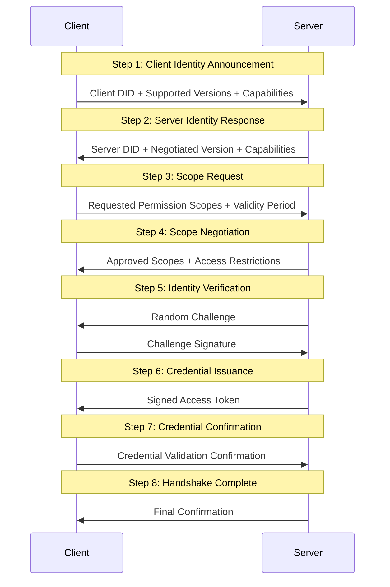

# Handshake Flow
The core of the ATH protocol is the 8-step trusted handshake process, which establishes a bidirectional trusted communication channel between the client and the server.
## 8-Step Handshake Flow Overview

## Detailed Step Description
### Step 1: Client Identity Announcement
The client initiates a connection request and announces its identity information to the server:
- **Client DID**: Decentralized identity identifier, uniquely identifies the client identity
- **Supported protocol version list**: ATH protocol versions supported by the client, sorted by priority
- **Client capability set**: Capabilities such as encryption algorithms and authentication methods supported by the client
- **Optional identity credential**: Third-party identity credentials held by the client, used to enhance identity credibility
### Step 2: Server Identity Response
The server responds to the client's identity announcement and returns its own identity information:
- **Server DID**: Decentralized identity identifier of the server
- **Negotiated protocol version**: The highest version supported by both parties selected from the version list provided by the client
- **Server capability set**: Capabilities such as encryption algorithms and authentication methods supported by the server
- **Server metadata**: Contains configuration information such as service endpoint information, supported scope lists, and token validity periods
### Step 3: Scope Request
The client requests the resource scope that needs to be accessed from the server:
- **Permission list**: Resource and operation permissions that the client needs to access, in the format `resource:operation` (e.g., `user:read`, `data:write`)
- **Access validity period**: The validity period of the access credential requested by the client
- **Request context**: Optional context information used to explain the purpose of access, business scenarios, etc.
### Step 4: Scope Negotiation
The server reviews and negotiates the scope requested by the client according to its own security policy:
- **Approved scope list**: The permission scope that the server finally agrees to grant to the client
- **Rejected scopes and reasons**: For rejected permissions, return a clear reason for rejection
- **Access restriction conditions**: Restriction conditions attached to the granted permissions, such as IP restrictions, rate limits, etc.
### Step 5: Identity Verification
Both parties perform identity authenticity verification to ensure that the other party's identity is credible:
- The server generates a random challenge string and sends it to the client
- The client signs the challenge string with its own private key and returns the signature to the server
- The server verifies the validity of the signature using the client's public key to confirm the client's identity
- Optional: The client can also initiate a challenge to the server for two-way identity verification
### Step 6: Credential Issuance
The server issues short-term access credentials to the client:
- Generate access tokens that comply with protocol specifications (supports JWT, PASETO and other formats)
- The token content includes information such as the DID of both parties, negotiated scope, validity period, and issuance time
- Sign the token with the server's private key to ensure that the token cannot be tampered with
### Step 7: Credential Confirmation
The client verifies the validity of the received access credential and sends confirmation to the server:
- The client verifies the validity of the token signature using the server's public key
- Confirm that the token content is consistent with the previously negotiated result
- Send a confirmation message to the server indicating that the credential has been received and verified
### Step 8: Handshake Complete
Both parties confirm that the handshake process is successfully completed:
- The server returns a final confirmation message
- Officially establish a trusted communication channel
- All subsequent business requests are authenticated using the issued access credentials
## Security Features
- **Two-way identity authentication**: Ensure the authenticity of both parties' identities through asymmetric encryption
- **Principle of least privilege**: The server only grants the necessary access permissions to the client
- **Short-term credentials**: The access credential has a short validity period, reducing the risk of credential leakage
- **Non-repudiation**: All interactions are signed, auditable and traceable
