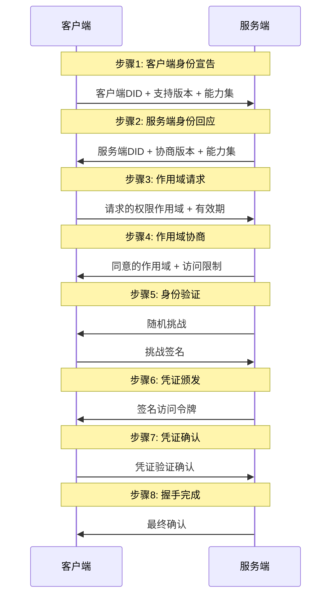

# ATH可信代理握手协议 - 中文注释版
> 🎯 通俗易懂版，非技术人员也能看懂
---
## 握手流程
## 8步握手流程概览

## 详细步骤说明
### 步骤1：客户端身份宣告 (Client Identity Announcement)
客户端发起连接请求，向服务端宣告自身身份信息：
- **客户端DID**：去中心化身份标识，唯一标识客户端身份
- **支持的协议版本列表**：客户端支持的ATH协议版本号，按优先级排序
- **客户端能力集**：客户端支持的加密算法、认证方式等能力
- **可选身份凭证**：客户端持有的第三方身份凭证，用于增强身份可信度
### 步骤2：服务端身份回应 (Server Identity Response)
服务端回应客户端的身份宣告，返回自身身份信息：
- **服务端DID**：服务端的去中心化身份标识
- **协商后的协议版本**：从客户端提供的版本列表中选择的双方都支持的最高版本
- **服务端能力集**：服务端支持的加密算法、认证方式等能力
- **服务端元数据**：包含服务端点信息、支持的作用域列表、令牌有效期等配置
### 步骤3：作用域请求 (Scope Request)
客户端向服务端请求需要访问的资源作用域：
- **权限列表**：客户端需要访问的资源和操作权限，格式为`资源:操作`（如`user:read`, `data:write`）
- **访问有效期**：客户端请求的访问凭证有效期
- **请求上下文**：可选的上下文信息，用于说明访问目的、业务场景等
### 步骤4：作用域协商 (Scope Negotiation)
服务端根据自身安全策略对客户端请求的作用域进行审核和协商：
- **同意的作用域列表**：服务端最终同意授予客户端的权限范围
- **拒绝的作用域及原因**：对于拒绝的权限，返回明确的拒绝原因
- **访问限制条件**：对授予的权限附加的限制条件，如IP限制、速率限制等
### 步骤5：身份验证 (Identity Verification)
双方进行身份真实性验证，确保对方身份可信：
- 服务端生成随机挑战字符串发送给客户端
- 客户端使用自身私钥对挑战字符串进行签名，并将签名返回给服务端
- 服务端使用客户端的公钥验证签名有效性，确认客户端身份
- 可选：客户端也可以向服务端发起挑战，进行双向身份验证
### 步骤6：凭证颁发 (Credential Issuance)
服务端向客户端颁发短期访问凭证：
- 生成符合协议规范的访问令牌（支持JWT、PASETO等格式）
- 令牌内容包含：双方DID、协商的作用域、有效期、颁发时间等信息
- 使用服务端私钥对令牌进行签名，确保令牌不可篡改
### 步骤7：凭证确认 (Credential Confirmation)
客户端验证收到的访问凭证有效性，并向服务端发送确认：
- 客户端使用服务端公钥验证令牌签名有效性
- 确认令牌内容与之前协商的结果一致
- 向服务端发送确认消息，表示已收到并验证通过凭证
### 步骤8：握手完成 (Handshake Complete)
双方确认握手流程成功完成：
- 服务端返回最终确认消息
- 正式建立可信通信通道
- 后续所有业务请求都使用颁发的访问凭证进行认证

## 📚 版本信息
- 协议版本：v0.1
- 更新时间：2026年4月
